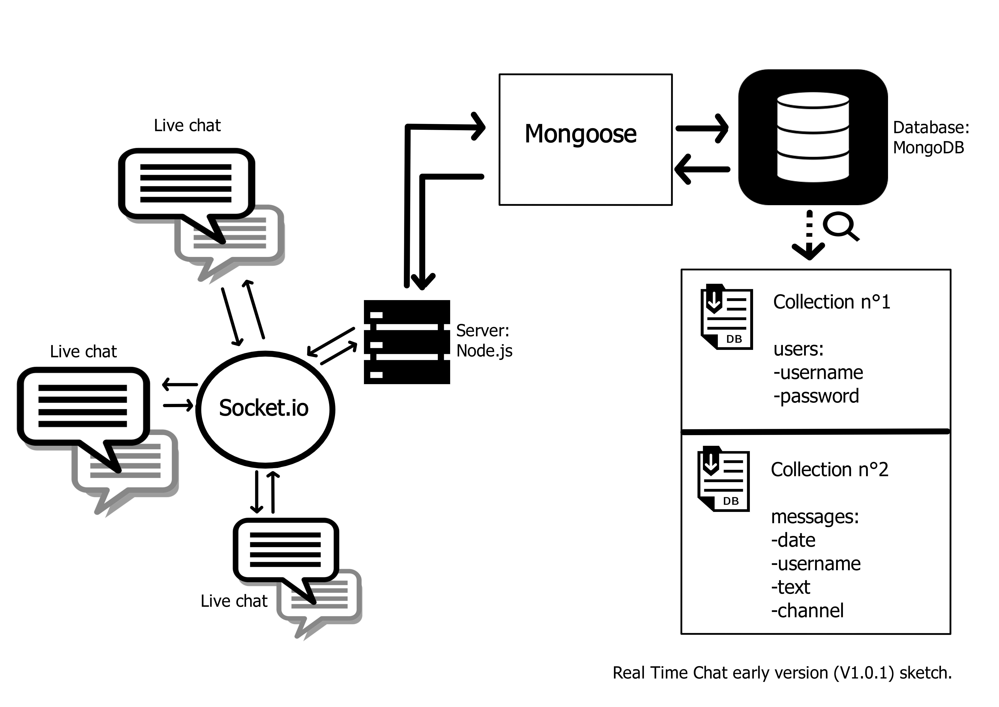

# 💬 RealTime Chat

## ◾ Features

<ul>
  <li>Real-time chat is a dynamic website application.</li>
  <li>It provides a secure and anonymous chat service that respects the user privacy.</li>

</ul>

<hr>

<p align="center">
  
</p>

<hr>

## ◾ Motivation

It has been launch the 💠02/12/2019💠 in the case of a school project (<a href="https://github.com/becodeorg" target="_blank">BeCode</a>).

Below, you will find our guidelines hosted on the school repo: 

▪️▪️▪️▪️▪️▪️▪️▪️▪️▪️▪️▪️▪️▪️▪️▪️▪️▪️▪️▪️▪️▪️▪️▪️▪️▪️▪️▪️▪️▪️▪️▪️▪️▪️▪️▪️▪️▪️▪️▪️▪️▪️▪️▪️▪️▪️▪️▪️▪️▪️▪️▪️▪️▪️▪️▪️▪️▪️▪️▪️▪️▪️▪️▪️▪️▪️▪️▪️▪️▪️▪️▪️▪️▪️▪️▪️▪️▪️▪️▪️▪️▪️▪️▪️▪️▪️▪️▪️▪️▪️▪️▪️▪️▪️▪️▪️▪️▪️▪️▪️▪️▪️▪️▪️▪️▪️▪️▪️▪️▪️▪️▪️▪️▪️▪️▪️▪️▪️▪️▪️▪️▪️▪️▪️▪️▪️▪️

== Missions objectives

At the end of this challenge you should be able to:

* create a *chat* in *Node.js* 
* install libraries with *npm*
* use *Express.JS*
* use *Socket.IO*


== The mission

You have to make a _real-time chat_ using {node}[Node.js], {express}[Express.JS]
and {socket}[Socket.IO].

.Original instructions
* write your server with *Node.js* and *Express.JS*
* handle real time chatting with *Socket.IO*
* allow for different user at the same time
* keep messages after reloading the page

.Additional instructions
* implement a {bship}[battleship] game in the chat
* allow user to write *MarkDown* in the input to style their messages
* add user accounts with _username_, _profile picture_ and _description_
* allow user to edit or delete their messages
* make it the most beautiful chat ever


=== Resources

* https://nodejs.org/en/docs/[Node documentation]
* https://socket.io/get-started/chat/[Socket.IO chat]

▪️▪️▪️▪️▪️▪️▪️▪️▪️▪️▪️▪️▪️▪️▪️▪️▪️▪️▪️▪️▪️▪️▪️▪️▪️▪️▪️▪️▪️▪️▪️▪️▪️▪️▪️▪️▪️▪️▪️▪️▪️▪️▪️▪️▪️▪️▪️▪️▪️▪️▪️▪️▪️▪️▪️▪️▪️▪️▪️▪️▪️▪️▪️▪️▪️▪️▪️▪️▪️▪️▪️▪️▪️▪️▪️▪️▪️▪️▪️▪️▪️▪️▪️▪️▪️▪️▪️▪️▪️▪️▪️▪️▪️▪️▪️▪️▪️▪️▪️▪️▪️▪️▪️▪️▪️▪️▪️▪️▪️▪️▪️▪️▪️▪️▪️▪️▪️▪️▪️▪️▪️▪️▪️▪️▪️▪️▪️

<hr>

## ◾ Tasks

- [x] Initialize the ReadMe and the trello.
- [x] Work on the main project.
- [ ] Launch the app.

ℹ️ For further informations, please make sure to visit our **Trello** [board](https://trello.com/b/NSohfKPi/real-time-chat) (only in french).

<hr>

## ◾ Build status

📲 V1.0.1
Logs
   - Readme initialized.
   - ...
   - ...
   - ...

<hr>

## ◾ Screenshots

### Api architecture
<p align="center">
  
</p>

<hr>

## ◾ Tech/framework used

1. Front-end
   - [React](https://reactjs.org/)
   - [Bootstrap](https://getbootstrap.com/)
   
2. Back-end
   - [Node.js](https://nodejs.org/en/)
     - [Express.js](https://expressjs.com/)
     - [Socket.io](https://socket.io/)

<hr>

## ◾ Code Example

```
function test() {
  console.log("This is a test for code input?");
}
```
